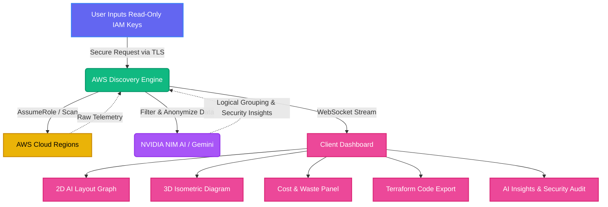

# The Interdictor Track: AWS Infrastructure Intelligence 🌐⚡

**The Interdictor Track** is an enterprise-grade AWS Infrastructure Intelligence platform designed to provide real-time visibility, cost optimization, and automated security analysis of your cloud environments.

---

##   Why Was This Project Built?

Modern cloud infrastructure is complex. DevOps engineers and system architects frequently spend hours manually logging into the AWS Console, clicking through 20+ different pages across multiple regions, just to understand:
1. *What exactly is running right now?*
2. *Where are we wasting money?*
3. *Are there any critical security flaws?*

Existing tools either produce unreadable "spaghetti diagrams" or require granting broad permissions to third-party services.

##   The Problem It Solves

- **The "Diagram Spaghetti" Problem:** Standard infrastructure graphs are often chaotic and unreadable due to overlapping lines.
- **Cost Blind Spots:** Leftover load balancers, orphaned EBS volumes, and idle EC2 instances drain company budgets silently.
- **Security Risks:** Simple misconfigurations, like an open Port 22 or a Single Point of Failure (SPOF), can lead to breaches or downtime.
- **Manual Auditing & IaC:** Bringing a manually created cloud environment back into Terraform code is tedious and error-prone.

##   How It Solves It

**The Interdictor Track** transforms raw, chaotic AWS telemetry into readable, intelligent diagrams and actionable insights:

1. **AI-Powered Layouts:** Uses NVIDIA NIM (Llama 3.1) to intelligently organize nodes for maximum readability.
2. **3D Isometric Views:** Presents the infrastructure in an immersive layered view (Networking → Compute → Data).
3. **Automated Cost & Waste Detection:** Points out specific resources that are costing money but aren't actively being used.
4. **AI Cloud Analyst:** Acts as a "Digital Cloud Consultant," reading your Truth Map and instantly flagging security vulnerabilities.
5. **Reverse Terraform Export:** Converts your live configuration directly into professional HCL files for Disaster Recovery or environment cloning.

---

##   Technologies Used in This Project

- **Frontend:** React 19, TypeScript, Vite, Tailwind CSS, React Router
- **Backend:** Node.js, Express, Socket.IO, TypeScript
- **Cloud & Infra:** AWS SDK v3 (EC2, ELB, S3, RDS, IAM, STS, Route53, CloudTrail, CloudWatch), Terraform (HCL export)
- **AI Integrations:** NVIDIA NIM, Google Gemini
- **Visualization:** React Flow, React Three Fiber + Three.js, Recharts, Leaflet
- **Data & Auth:** PostgreSQL (`pg`), JWT Authentication, bcrypt password hashing
- **Validation & Quality:** Zod schema validation, Vitest unit testing
- **Deployment/Runtime:** Docker, Docker Compose

##   Key Features Implemented (Resume-Ready)

- Built a **multi-region AWS infrastructure discovery engine** that maps resources and dependencies into a live "Truth Map".
- Implemented **real-time telemetry streaming** with Socket.IO, including personalized live sessions and demo mode fallback.
- Developed **AI-assisted architecture layout planning** with deterministic fallback when AI key/config is unavailable.
- Created an **interactive 3D isometric cloud architecture viewer** (networking → compute → data layers) using Three.js.
- Built a **cost estimation and waste detection module** that identifies orphaned/idle resources and highlights potential monthly savings.
- Implemented **AI infrastructure analyst workflows** to surface security, cost, architecture, and operational recommendations.
- Added **reverse Terraform export** to generate `provider.tf`, `variables.tf`, `main.tf`, and `outputs.tf` from discovered infrastructure.
- Designed **secure credential handling** with AES-256-CBC vault encryption, IAM least-privilege role assumption, and anonymized AI payloads.
- Added **role-based access control (admin/viewer)** with JWT, route/event authorization checks, and rate-limited login endpoint.
- Added **typed input validation** for critical socket/API flows using Zod to reduce unsafe payload handling.
- Added **health/readiness endpoints** and resilient fallback behavior when dependencies (like DB) are unavailable.

---

##   Visual Flow: How the Platform Works



---

##   Security First

All AWS Access Keys are encrypted using **AES-256-CBC** with a secure Vault Key and can be saved solely on the client side using secure local storage. Data passed to the AI models is strictly anonymized. 

##   Run Locally

**Prerequisites:** Node.js

1. Install dependencies:
   ```bash
   npm install
   ```
2. Set your API credentials (e.g., `GEMINI_API_KEY`, `NVIDIA_NIM_API_KEY`) in `.env.local` based on the `.env.example` format.
3. Run the development server:
   ```bash
   npm run dev
   ```
